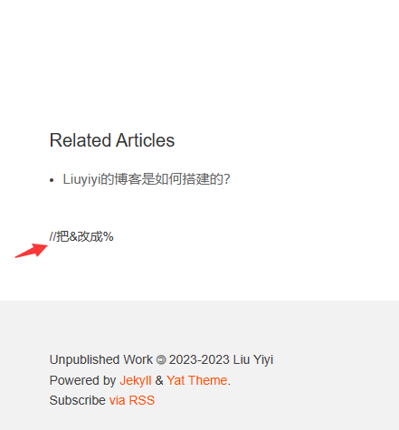
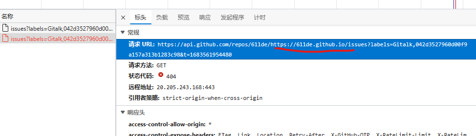

<!--
 * @Description: file content
 * @Author: Liuyiyi
 * @Date: 2023-05-07 22:39:08
 * @LastEditTime: 2023-05-08 21:18:42
 * @LastEditors: Liuyiyi
 * @Reference: 
-->

> 在“[Liuyiyi的博客是如何搭建的？](/_posts/2023-05-04-Liuyiyi的博客是如何搭建的？.md)”中介绍了博客是如何搭建的，在这篇博客中介绍一下如何为博客增加评论功能

因为是静态博客，讲道理是没有评论这种动态功能的，但只要思想不滑坡办法总比困难多。[utterances](https://utteranc.es/)就是一个利用Github的issue功能来在静态博客里面实现评论的项目。

<font color=silver>_github的issue功能还挺多，不光可以用来issue，还有大佬用来写 [博客](https://github.com/rainzhaojy/blogs/issues/1) [博客](https://github.com/yihong0618/gitblog/issues)_</font>

<!-- ## 1.找个教程 -->
<!-- 找到个[教程](https://blog.csdn.net/cpongo3/article/details/89210596) -->
<!-- #### 2.跟着做 -->
<!-- 一步一步
##### 2.1 注册一个Application
github注册一个Application
##### 2.2 添加gitalk代码
按步骤加

#### 3.看下结果
评论框没有，注释还在

😨😨😨失败，不知道为啥

本来打算放弃，又按了一下<kbd>F12</kbd>，在network中发现是`md5.min.js`没有。

`md5.min.js`的链接：[https://cdn.bootcss.com/blueimp-md5/2.10.0/js/md5.min.js](https://cdn.bootcss.com/blueimp-md5/2.10.0/js/md5.min.js)
重新提交代码后，出现了下面的画面，又失败了

再F12看看，没看明白咱回事，也不知道这URL对不对
 -->

## 1. 安装utterances
在Github App中安装utterances app，点击[https://github.com/apps/utterances](https://github.com/apps/utterances), 然后点点点...把博客对应仓库的issue的读写权限给utterances。
## 2 修改模板配置
最开始尝试使用`gitalk`来实现评论功能，搞了半天没整明白，结果翻博客模板的文件的时候看见了一个`extensions`文件夹，里面直接放了三个评论实现方式，分别是`disqus`、`gitment`、`utterances`, 要不说这模板好呢，作者早就整好了。随便了解了一下这几种方式，选了`utterances`，说是方便简单无广告。
直接去配置文件`_config.yml`里面找到这几行并取消注释，把repo按`onwer/repo`的格式改成自己的，提交代码就好了。 
```yml
utterances:
  repo: "611de/611de.github.io"
  issue_term: "title"
  label: "utterances comment"
  theme: "github-light"
  follow_site_theme: true
```
最后的效果，把页面往下翻就可以看到
## 3. 总结
模板选得好，害得是我😕（感谢🙏模板作者[Jeffrey Tse](https://github.com/jeffreytse)）~