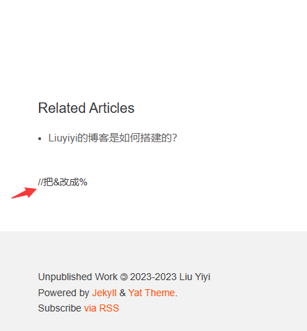

<!--
 * @Description: file content
 * @Author: Liuyiyi
 * @Date: 2023-05-07 22:39:08
 * @LastEditTime: 2023-05-08 21:18:42
 * @LastEditors: Liuyiyi
 * @Reference: 
-->

> 在“[Liuyiyi的博客是如何搭建的？](/_posts/2023-05-04-Liuyiyi的博客是如何搭建的？.md)”中介绍了博客是如何搭建的，在这篇博客中介绍一下如何为博客增加评论功能

因为是静态博客，讲道理是没有评论这种动态功能的，但只要思想不滑坡办法总比困难多。gitalk就是利用github的issue功能来在静态博客里面实现评论的项目。

那具体咋用呢？

_github的issue功能还挺多，不光可以用来issue，还有大佬用来写[博客](https://github.com/rainzhaojy/blogs/issues/1) [博客](https://github.com/yihong0618/gitblog/issues)_

#### 1.找个教程
找到个[教程](https://blog.csdn.net/cpongo3/article/details/89210596)

#### 2.跟着做
一步一步
#### 3.看下结果

😨😨😨失败，不知道为啥

#### 4. 总结
不显示就算球了😕
