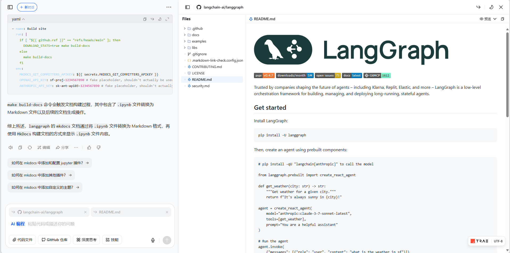

在 `langgraph` 项目中有许多的文档，仔细观察可以发现许多文档是只有 `.ipynb` 这样的笔记本格式，并没有直接的 Markdown 文本与之对应。文档使用 `mkdocs` 来构建，但 `mkdocs.yaml` 文件中也没有 jupyter 相关的插件，那 `langgraph` 到底是怎么直接展示 `ipynb` 文件的文档的呢？下面是豆包给的回答：

`mkdocs` 文档要显示 `.ipynb` 文件，主要涉及到将 `.ipynb` 文件转换为 Markdown 格式的过程，下面详细分析实现步骤：

### 1. 文档结构与编写
`langgraph` 的文档内容存于 `/docs` 目录，采用 IPython 笔记本（`.ipynb` 文件）和 Markdown（`.md` 文件）结合的方式编写。可参考 `langgraph/CONTRIBUTING.md` 里的说明：
```
The content for the main documentation is located in the `/docs` directory of the monorepo.

The documentation is written using a combination of ipython notebooks (`.ipynb` files)
and markdown (`.md` files). The notebooks are converted to markdown
and then built using [MkDocs](https://www.mkdocs.org/).
```

### 2. `.ipynb` 文件转换为 Markdown
项目里存在用于把 `.ipynb` 文件转换为 Markdown 格式的脚本，像 `langgraph/docs/_scripts/generate_llms_text.py` 中的 `convert_ipynb_to_md` 函数：
```python
async def convert_ipynb_to_md(file_path: str) -> Optional[str]:
    rel_path = os.path.relpath(file_path, SOURCE_DIR)

    # Create File and Page objects to match mkdocs structure
    file_obj = File(
        path=rel_path, src_dir=SOURCE_DIR, dest_dir="", use_directory_urls=True
    )
    page = Page(
        title="",
        file=file_obj,
        config={},
    )

    try:
        # Read raw content
        with open(file_path, "r", encoding="utf-8") as f:
            content = f.read()

        # Convert to markdown without logic to resolve API references
        processed_content = _on_page_markdown_with_config(
            content, page, add_api_references=False, remove_base64_images=True
        )
        # Remove self-closing img tags 
        processed_content = re.sub(r"]*/>", "", processed_content)
        # Remove img tags with content ...</img>
        processed_content = re.sub(
            r"]*>.*?</img>", "", processed_content, flags=re.DOTALL
        )
        return processed_content
    except Exception as e:
        print(f"Error processing file {file_path}: {e}")
        return None
```
此函数会读取 `.ipynb` 文件内容，接着借助 `_on_page_markdown_with_config` 函数将其转换为 Markdown 格式，同时还会移除一些不必要的图片标签。

### 3. 链接标准化
为保证转换后的 Markdown 文件里的链接格式符合 `mkdocs` 要求，项目中还有链接标准化的脚本，例如 `langgraph/docs/_scripts/notebook_convert.py` 中的 `_convert_links_in_markdown` 函数：
```python
def _convert_links_in_markdown(markdown: str) -> str:
    pattern = (
        r"(?<!!)"
        r"\["
        r"(?P<text>[^\]]*)"
        r"\]"
        r"\("
        r"(?![^\)]*//)"
        r"(?P<url>[^)]*)"
        r"\)"
    )

    def custom_replacement(match):
        text = match.group("text")
        url = match.group("url")

        if url.startswith("../"):
            url = url[3:]

        url = url.rstrip("/")

        if "#" in url:
            url, fragment = url.split("#")
            url = url.rstrip("/")
            return f"[{text}]({url}.md#{fragment})"
        return f"[{text}]({url}.md)"

    return re.sub(
        pattern,
        custom_replacement,
        markdown,
    )
```
该函数会把 Markdown 中的链接转换为以 `.md` 为扩展名的格式。

### 4. 使用 MkDocs 构建文档
最后，运用 `MkDocs` 来构建文档。项目的 `langgraph/docs/mkdocs.yml` 文件对文档的结构、主题、插件等进行了配置，文档构建命令在 `langgraph/.github/workflows/deploy_docs.yml` 中有体现：
```yaml
- name: Build site
  run: |
    if [ "${{ github.ref }}" == "refs/heads/main" ]; then
      DOWNLOAD_STATS=true make build-docs
    else
      make build-docs
    fi
  env:
    MKDOCS_GIT_COMMITTERS_APIKEY: ${{ secrets.MKDOCS_GIT_COMMITTERS_APIKEY }}
    OPENAI_API_KEY: sf-proj-1234567890 # fake placeholder, shouldn't actually be used
    ANTHROPIC_API_KEY: sk-ant-api03-1234567890 # fake placeholder, shouldn't actually be used
```
`make build-docs` 命令会触发文档构建过程，其中包含了 `.ipynb` 文件转换为 Markdown 文件以及后续的文档生成操作。

综上所述，`langgraph` 的 `mkdocs` 文档通过将 `.ipynb` 文件转换为 Markdown 格式，再使用 `MkDocs` 构建文档的方式来显示 `.ipynb` 文件内容。 


### 5. 具体的被调用的过程

首先是在 MkDocs 的配置文件 `mkdocs.yaml` 中，使用了 hooks 配置如下：
```
hooks:
  - _scripts/notebook_hooks.py
```
hooks 允许你在 MkDocs 构建过程的特定阶段执行自定义 Python 代码，以实现一些定制化的功能, MkDocs 有一些预定义的钩子函数名，如 on_page_markdown、on_files 等。在自定义钩子脚本中，你可以定义这些函数，MkDocs 会在相应的阶段调用它们。
在 `notebook_hooks.py` 文件中直接使用了 `convert_notebook` 方法如下:
```python
if page.file.src_path.endswith(".ipynb"):
    # logger.info("Processing Jupyter notebook: %s", page.file.src_path)
    markdown = convert_notebook(page.file.abs_src_path)
```
至此可知，LangGraph 配置了 MkDocs 的 hook，使得在打包阶段会自动的调用已经配置好的 hook 来完成从 `.ipynb` 文件到 `.md` 文件的转换。

---
[豆包](https://www.doubao.com/)
