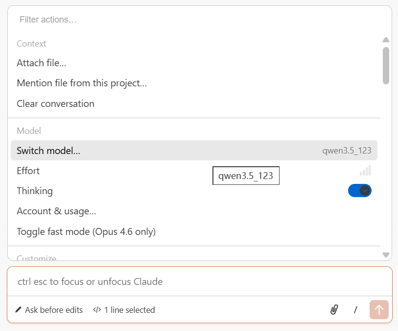
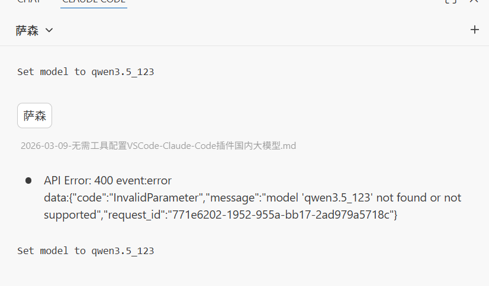

Claude Code 是 Anthropic 推出的强大 AI 编程助手，vscode 中的claude code 插件通过改环境变量还太行。想用国内大模型（通义千问、DeepSeek、智谱 GLM 等）替代，却不知道如何配置。`cc-switch` 等第三方工具虽然还算方便，但需要额外安装。

本文将介绍一种**纯手动配置方案**，只需修改 VSCode 的 `settings.json`，即可实现 Claude Code 对接国内大模型，无需任何第三方工具。

## 为什么选择手动配置？
懒得装 `cc-switch` 

## 核心原理：三个关键环境变量

Claude Code 插件通过以下三个环境变量控制模型选择：

| 环境变量 | 对应插件选项 | 用途 |
|---------|-------------|------|
| `ANTHROPIC_DEFAULT_OPUS_MODEL` | Opus | 高性能档位 |
| `ANTHROPIC_DEFAULT_SONNET_MODEL` | Default/Sonnet | 默认档位 |
| `ANTHROPIC_DEFAULT_HAIKU_MODEL` | Haiku | 轻量档位 |

当你在插件中切换模型时，它会读取对应的环境变量值作为实际调用的模型名。

## 配置步骤

### Step 1：获取国内模型 API Key

以通义千问为例：
1. 访问 [阿里云百炼平台](https://bailian.console.aliyun.com/)
2. 开通服务并创建 API Key
3. 记录下 API Key 和模型名称

### Step 2：修改 VSCode settings.json

打开 VSCode 设置（`Ctrl+,` / `Cmd+,`），搜索「Claude Code: Environment Variables」，点击「Edit in settings.json」。

添加以下配置：

```json
{
  "claudeCode.environmentVariables": [
    {
      "name": "ANTHROPIC_BASE_URL",
      "value": "https://dashscope.aliyuncs.com/apps/anthropic"
    },
    {
      "name": "ANTHROPIC_AUTH_TOKEN",
      "value": "你的API Key"
    },
    {
      "name": "ANTHROPIC_DEFAULT_OPUS_MODEL",
      "value": "qwen3.5-120b"
    },
    {
      "name": "ANTHROPIC_DEFAULT_SONNET_MODEL",
      "value": "qwen3.5-72b"
    },
    {
      "name": "ANTHROPIC_DEFAULT_HAIKU_MODEL",
      "value": "qwen3.5-7b"
    }
  ],
  "claudeCode.disableLoginPrompt": true,
  "claudeCode.selectedModel": "default"
}
```

### Step 3：验证配置生效

1. 保存配置后重启 VS Code（或执行「Developer: Reload Window」）
2. 打开 Claude Code 插件面板
3. 点击「Switch Model」，选择不同档位测试



## 主流平台配置模板

### 通义千问（阿里云）

```json
{
  "claudeCode.environmentVariables": [
    { "name": "ANTHROPIC_BASE_URL", "value": "https://dashscope.aliyuncs.com/apps/anthropic" },
    { "name": "ANTHROPIC_AUTH_TOKEN", "value": "你的通义千问API Key" },
    { "name": "ANTHROPIC_DEFAULT_OPUS_MODEL", "value": "qwen3.5-120b" },
    { "name": "ANTHROPIC_DEFAULT_SONNET_MODEL", "value": "qwen3.5-72b" },
    { "name": "ANTHROPIC_DEFAULT_HAIKU_MODEL", "value": "qwen3.5-7b" }
  ],
  "claudeCode.disableLoginPrompt": true
}
```
其他厂商类似


## 总结

通过手动配置 `ANTHROPIC_DEFAULT_OPUS/SONNET/HAIKU_MODEL` 三个环境变量，我们可以：

1. **无需第三方工具**：直接在 VSCode 中完成配置
2. **安全可靠**：API Key 只保存在本地
3. **灵活切换**：三个档位可分别映射不同的国内模型

关键配置项速查：
- `ANTHROPIC_BASE_URL`：国内模型的 Anthropic 兼容接口地址
- `ANTHROPIC_AUTH_TOKEN`：你的 API Key
- `ANTHROPIC_DEFAULT_SONNET_MODEL`：默认使用的模型（最常用）

---
## 引用
[Claude Code 模型配置](https://code.claude.com/docs/en/model-config#checking-your-current-model)