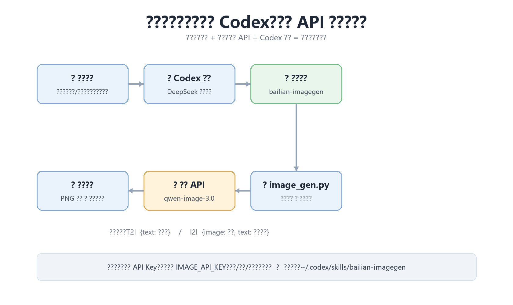
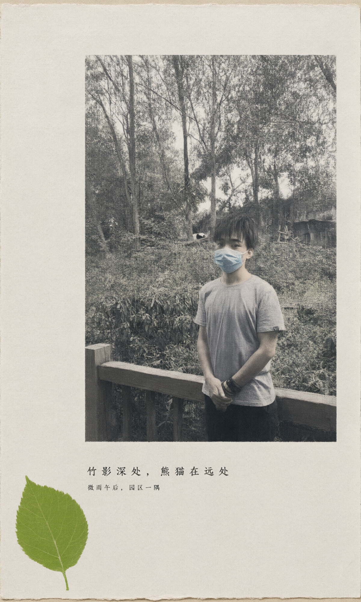

> 一次完整的接入实录：为什么内置图像工具不可用、如何用阿里百炼 Qwen-Image API + Codex 技能曲线救国，以及直接基于参考图片出图的 I2I 玩法。

## TL;DR

- **现象**：Codex 使用 DeepSeek API（纯文本），内置的 `image_gen` 工具不出现，说“画一只猫”没有反应。
- **原因**：内置图像工具由 OpenAI 平台托管，和推理模型解耦，但绑定 OpenAI 账号，换 DeepSeek 后端后不会暴露。
- **方案**：把百炼 `qwen-image-3.0` 封装成脚本 + Codex 个人技能，以后新会话里直接说“画一只猫”，Codex 会自动调用百炼出图。
- **进阶**：Qwen-Image 3.0 原生支持图生图（I2I），参考图片直接提交 API，不需要先转成文字描述。
- **更强者**：`qwen-image-3.0-pro`（2K、小字渲染）和 `wan2.7-image-pro`（4K 文生图、最多 9 张参考图、交互式编辑）。



## 1. 背景与问题

我本地的 Codex 配置的是 **DeepSeek API** 作为推理模型（文本模型）。当我想让它生成图片时发现：

1. 内置的图像生成工具（`image_gen`）在工具列表里根本不存在；
2. DeepSeek 官方 API 没有图像生成接口，请求 `/v1/images/generations` 会返回 404；
3. 看起来“模型能推理、能写代码”，但就是画不了图。

## 2. 为什么内置工具不可用

Codex 的 `image_gen` 是一个 **OpenAI 平台托管的扩展工具**：它的服务端是 OpenAI 的图像模型，跟随 ChatGPT 账号 / OpenAI 平台下发。它和你用哪个模型推理无关，但**绑定 OpenAI 生态**。所以当你把模型后端换成 DeepSeek 时，这个工具就不会出现。

关键认知：**工具调用和推理模型是解耦的**。模型负责“决定要不要调用工具”，工具本身可以来自任何地方。这给了我们绕行的空间。

## 3. 方案：第三方图像 API + Codex 技能

既然内置工具不可用，就自己做“内置能力”：

1. 写一个通用的图像生成脚本（Python，只依赖标准库），支持两类接口：
   - **OpenAI 兼容**：`POST /v1/images/generations`（硅基流动等）
   - **Qwen 原生**：百炼的 `multimodal-generation/generation`（DashScope 格式）
2. 把它封装成 Codex 个人技能（skill），装进 `~/.codex/skills/`。
3. 技能目录在会话启动时加载，新会话里只要说“画一只猫”，Codex 就会自动触发技能并调用百炼出图。

## 4. 落地过程

### 4.1 百炼 Qwen-Image 接口细节

百炼的 Qwen-Image 3.0 走 **DashScope 原生接口**（不是 OpenAI 兼容路径）：

```text
POST https://dashscope.aliyuncs.com/api/v1/services/aigc/multimodal-generation/generation
Authorization: Bearer <百炼API Key>
```

**文生图（T2I）请求体：**

```json
{
  "model": "qwen-image-3.0",
  "input": {
    "messages": [{
      "role": "user",
      "content": [{ "text": "一只圆脸橘色小猫坐在窗台上……" }]
    }]
  },
  "parameters": { "prompt_extend": true, "size": "1024*1024" }
}
```

**图生图 / 编辑（I2I）请求体：** 图片直接放 `content` 数组里，支持 1–3 张（URL 或 Base64）：

```json
{
  "model": "qwen-image-3.0",
  "input": {
    "messages": [{
      "role": "user",
      "content": [
        { "image": "data:image/jpeg;base64,...." },
        { "text": "把这张照片做成一张极简 zine 风格旧纸海报……" }
      ]
    }]
  },
  "parameters": { "size": "1200*2000" }
}
```

返回的图片 URL 只有 24 小时有效期，脚本会自动下载保存为本地 PNG。

### 4.2 调试踩坑记录

真实接入时踩了几个坑，记下来给同事省时间：

1. **Key 地域**：百炼 API Key 分地域（北京/新加坡等），跨地域调用会鉴权失败或 404。先用最小的 chat 请求探测 Key 属于哪个地域，再定 base URL。
2. **模型 ID**：是 `qwen-image-3.0` / `qwen-image-3.0-pro`，不是 `qwen-image`；用错 ID 会 404。
3. **默认 Base URL bug**：脚本一开始根据环境变量算默认地址，导致显式传 `--api qwen` 时仍打到默认的 OpenAI 兼容地址。修复：默认值必须根据“生效的 api 模式”计算。
4. **超时**：图生图比文生图慢，第一次 240 秒超时，把超时调到 600 秒后正常。
5. **不要存 Key**：Key 只从环境变量读取（进程 → 用户 → 系统三级查找），不写进任何脚本或仓库文件。

### 4.3 封装成技能

技能的本质是一个 `SKILL.md`：frontmatter 里的 `name` + `description` 决定什么时候被触发，正文告诉 Codex 怎么调用脚本。

```text
~/.codex/skills/bailian-imagegen/
├── SKILL.md              # 触发规则 + 使用说明
├── agents/openai.yaml    # UI 元数据
└── scripts/image_gen.py  # 生成脚本（支持 T2I / I2I）
```

技能是会话启动时加载的，所以**安装后要新开一个会话**才生效。

## 5. 真实效果

### 5.1 文字提示词出图（T2I）

先有提示词，再调用图像 API。用 gc-minimal-zine-poster 技能把照片内容编译成“极简 zine 海报”提示词后生成：


### 5.2 直接基于参考图片出图（I2I）

更优的做法：**直接把原图提交给 API**，文字只作为编辑指令，模型基于图片本身改造：



左边这张海报就是拿用户照片直接提交百炼生成的，不再需要“先让视觉模型描述 → 转文字”的绕路。

## 6. 更强的模型

| 模型 | 强在哪 |
|---|---|
| `qwen-image-3.0-pro` | 2K 分辨率、10px 级小字渲染、长提示词、中文排版海报最强；和 `qwen-image-3.0` 同接口，改模型名即可 |
| `wan2.7-image-pro` | 文生图最高 4K、图生图/编辑 2K、最多 9 张参考图、角色一致性、交互式框选编辑（bbox）、品牌色板控制 |

## 7. 安全提醒

- API Key 不要贴到聊天记录、仓库或文档里；只通过环境变量注入。
- 一旦 Key 出现在不可信环境（比如聊天记录），去控制台**重置**。
- 技能脚本里永远不写死 Key。

## 8. 3 分钟上手

```powershell
# 1. 申请百炼 API Key（bailian.console.aliyun.com），设为用户级环境变量
[Environment]::SetEnvironmentVariable("IMAGE_API_KEY", "sk-你的key", "User")

# 2. 把技能目录放到 ~/.codex/skills/（bailian-imagegen）

# 3. 新开一个 Codex 会话，直接说：
#    画一只猫
#    或：用这张照片做一张 zine 风格海报
```

## 9. 经验总结

1. **内置工具不是唯一能力**：当平台内置工具不可用时，技能（skill）和 MCP 是把外部 API 变成“内置能力”的标准姿势。
2. **模型与工具解耦**：推理模型负责决策，工具负责执行；换模型后端不代表要放弃工具生态。
3. **能直接图生图就别绕路**：先描述再生成的链路（视觉模型 → 文字 → 生图）适合模型看不了图的场景；只要 API 支持图片输入，直接提交图片效果更好、主体一致性更强。

---

附：完整实现代码在 `D:\Project\imagegen-helper\image_gen.py`（通用、两种 API 模式、支持 `--image` 图生图）。
